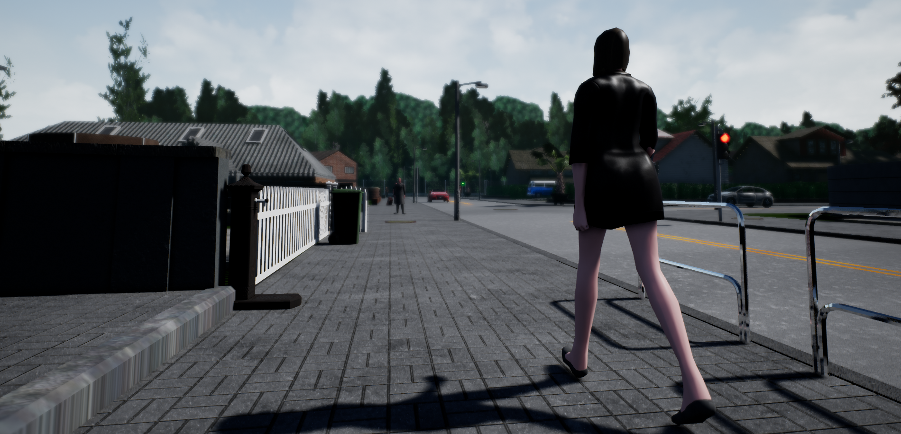
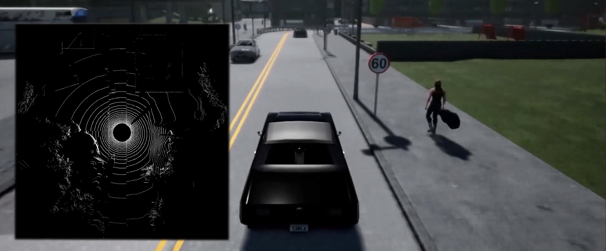

# CARLA 0.8.0

在这个版本中，主要致力于提高速度，但也进行了许多其他方面的改进，包括社区的一项重要贡献——激光雷达的实现！

已将虚幻引擎升级至 4.18 版本。如果您是从源代码构建，则需要升级您的虚幻引擎版本。此外，我们还对客户端与服务器之间的通信进行了一些更改，因此旧版本的客户端将无法与此版本兼容。与往常一样，更新后的 Python API 也包含在版本发布包中。

CARLA 文档也已更新为更像教程的形式，希望能帮助新用户入门 CARLA。

## 快点，Carla ！

社区一直在努力提升 CARLA 的速度。我们主要专注于提高图像采集性能，因此在仅使用摄像头且不添加任何代理（没有其他车辆和行人）的情况下运行 CARLA 时，速度提升最为显著，最高可达 45%。

社区对场景的多个方面进行了改进，以提高渲染速度：优化了着色器，减少了纹理，提高了树木的细节程度，并将背景简化为数字绘景。与此同时，我们还改进了图像的采集方式以降低延迟（更多信息见下文）。

### 质量水平
在此版本中，还引入了质量等级设置。每个模拟回合都可以单独配置，用于控制模拟的视觉质量。目前我们已实现了“低”和“史诗”两种模式，未来计划添加其他中间等级。“低”模式会大幅降低图像质量，但运行速度会显著提升。这在视觉质量并非至关重要，而需要在短时间内运行大量模拟回合的场景中尤为实用，例如在测试强化学习方法时。

| 传感器  | 0.7.1  |  0.8.0 史诗模式  |  0.8.0 低模式  |
|-----|----------|----------|----------|
| 没有摄像头   | 22帧/秒 |  26帧/秒 | 60帧/秒 |
| 一台摄像机   | 9帧/秒 |  13帧/秒 | 45帧/秒 |  
| 没有摄像头   | 4帧/秒 |  6帧/秒 | 15帧/秒 |                      

!!! 表格
    CARLA 版本之间的比较，在Town01上，在一台运行 Ubuntu 16.04 和 GTX1080 GPU 的机器上，以 20 辆车和 30 个行人为典型场景进行测量。

提升 CARLA 的性能是目前的首要任务。我们对目前的速度还不满意，我们将在后续版本中继续努力提升 CARLA 的速度。

## 完全免费且可分发的资产

我们创建了自己的行人 3D 模型，完全免费使用和分发。此外，我们还移除了对 Epic 汽车材质包的所有依赖。这样，在从源代码构建 CARLA 时，就不需要下载并链接该软件包；当然，仍然可以将其添加到项目中，但这现在是可选步骤。我们的发布版本现在不使用任何专有资源，CARLA 的所有组件都可以在我们的 GitHub 构建版本中找到。

## 测量单位发生了变化

这是一个重要的变化，可能会影响许多客户端代码；如果您正在开发自己的 CARLA 客户端，则在升级到 0.8.0 版本时应考虑到这一点。

现在 CARLA 到处都使用 SI 单位，所以我们终于可以告别我们一直带着的那些奇怪的单位了（是的，我们之前使用像(km/h)/s这样的单位来表示加速度）。

| 对象  | 单位  |
|-----|----------|
| 位置   | \( m \) |
| 速度   | \( m/s \) |
| 加速度   | \( m/s^2 \) |
| 碰撞   | \( kg \dot m/s \) |
| 角度   | \( 度 \) |
| 时间戳   | \( ms \) |

现在所有单位都统一，均源自国际单位制（SI）。客户收到的所有测量数据均使用米、秒和千克。出于实际考虑，我们仅保留了以毫秒为单位的时间戳。

## 社区贡献：光线投射激光雷达

本次版本更新包含了 Anton Pechenko（Yandex）的杰出贡献——一种基于光线投射的旋转激光雷达实现方案。与 [Velodyne(威力登)](https://baike.baidu.com/item/Velodyne/19904680) 的 HDL-32E 或 VLP-16 型号类似，该激光雷达实现方案完全可配置：通道数、每秒点数、频率、测量范围等等。激光雷达的安装方式与摄像头相同，可直接安装在车辆上。更多详情请参阅[激光雷达的文档](https://openhutb.github.io/doc/ref_sensors/#lidar-sensor)。

在客户端，每个激光雷达都会接收一个点云数据。我们添加了导出此点云数据的基本方法，将其导出为 PLY 格式，以便在 [MeshLab](http://www.meshlab.net/) 等外部软件中轻松可视化。

### 基于深度的点云
我们在 Python API 中添加了一些方法，用于从深度图像中提取 3D 点云。我们还编写了代码，将这些 3D 点转换为世界坐标。点云格式与激光雷达输出格式相同，因此转换结果与两者兼容，并且可以同样地保存为 PLY 格式。您可以在[point_cloud_example.py](https://github.com/carla-simulator/carla/blob/0.8.0/PythonClient/point_cloud_example.py) 文件中找到使用示例 。

## 异步捕获
如上所述，作为性能优化的一部分，图像现在在虚幻引擎的渲染线程中捕获。这样做可以降低延迟，并尽可能避免阻塞主线程。这显著降低了摄像机的开销，但对图像到达客户端的方式略有改变。

在异步模式下，图像到达时间可能比测量时间晚两帧。在虚幻引擎中，渲染线程拥有独立的专用线程，该线程的运行时间略微滞后于游戏线程。通过减少同步，整个模拟的运行速度可以提升。

在同步模式下，图像仍然在渲染线程中捕获，但在发送测量数据时，主线程会被阻塞，直到所有图像都准备就绪。这会带来一些开销，因此该模式下的性能提升并不显著。

## 更多变化
此外，还有许多其他的小更改和修复，有关完整的发行说明列表，请参阅我们 GitHub 上的 [CHANGELOG](https://github.com/carla-simulator/carla/blob/master/CHANGELOG.md#carla-080)。
