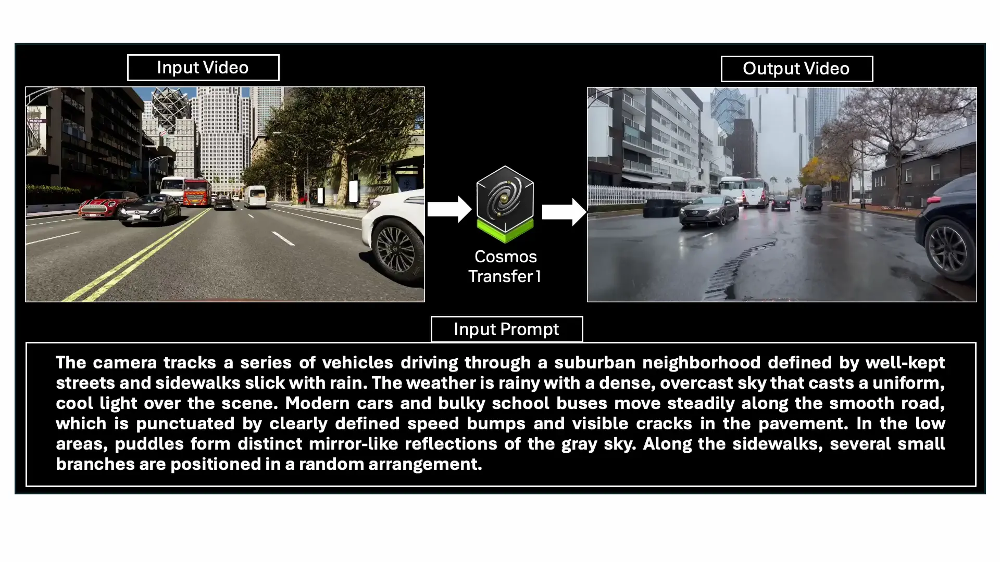
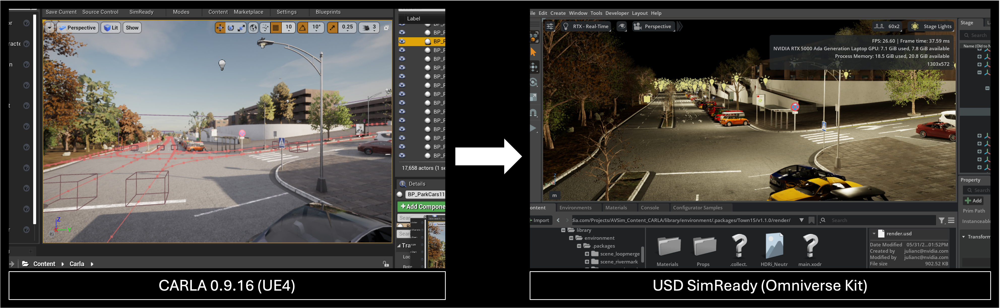
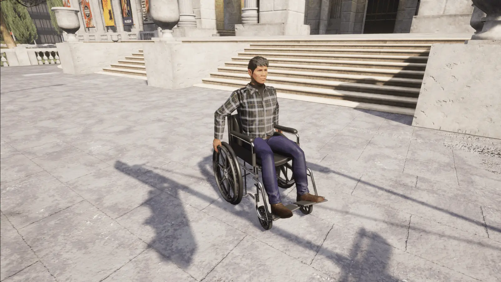

# CARLA 0.9.16 版本发布

Cosmos Transfer1 集成、NuRec 集成、ROS2、SimReady Converter、左转弯交通和弱势道路使用者


CARLA 0.9.16 对**虚幻引擎 4.26** 版本的 CARLA进行了一些重大升级，有望增强您的 CARLA 工作流程并提高模拟数据的多样性！

CARLA 0.9.16 集成了 NVIDIA 强大的全新渲染技术和导出选项。全新的**Cosmos Transfer1 基础风格迁移模型**允许使用文本提示生成 CARLA 仿真输出的多种风格变体，包括建筑、车辆、天气和光照条件的变化。Cosmos Transfer1 仅需一套仿真输入数据即可大幅增强 CARLA 生成的训练数据集的多样性！**NVIDIA NuRec**将神经重建技术引入 CARLA 引擎，允许重新渲染从真实世界传感器数据中学习到的 3D 场景，并可对视角、相机配置或轨迹扰动进行调整！NVIDIA 的 **SimReady 转换工具**支持将 SimReady 资源导出为**通用场景描述**(USD) 格式，以便轻松地从 Omniverse 传输到其他 USD 兼容应用程序。

CARLA 服务器现在**原生支持与 ROS 2 的连接**，无需桥接工具，从而降低了与 ROS 节点的连接延迟，实现了更流畅的模拟。

CARLA 0.9.16 版本新增了对**左侧通行规则**的支持！这项期待已久的功能终于上线，可以模拟英国或日本等实行左侧通行规则国家的交通状况。新增的**轮椅模型**使得将弱势道路使用者纳入 CARLA 生成的训练数据集成为可能。

无论您是在构建复杂的自主堆栈、试验数字孪生，还是将 CARLA 内容导出到其他平台——此版本都将使您更接近生产级仿真工作流程。

## 🧪NVIDIA Cosmos Transfer1 集成

此 CARLA 版本**集成了 NVIDIA Cosmos Transfer1**。Cosmos Transfer1 是一种基础风格的传递模型，旨在增强仿真输出。

借助 Transfer1，用户可以通过简单的文本提示，从 CARLA 序列生成**无数种超逼真的视频变体**。此功能非常适合以下场景：

* 扩展感知数据集中的视觉多样性
* 弥合模拟训练与真实训练之间的领域差距
* 探索具有逼真纹理、光照和天气变化的极端情况

此外，通过将此功能与 [Inverted AI](https://www.inverted.ai/apis#DRIVE) 的DRIVE API结合使用，用户可以生成具有无限视觉变化的逼真行为。这是训练 AV 堆栈的完美组合！您可以在此处阅读更多相关内容：[NVIDIA：利用神经重建和世界基础模型加速 AV 仿真](https://developer.nvidia.com/blog/accelerating-av-simulation-with-neural-reconstruction-and-world-foundation-models/)。


## 🎥 使用 NVIDIA NuRec 进行神经重建
核


该版本还引入了对 **NVIDIA NuRec 25.07 的支持**，NuRec 25.07 是一种最先进的神经渲染管线。

通过这种集成，CARLA 场景可以使用学习到的光照和几何形状表示进行渲染，从而实现：

* 从任意视角进行逼真渲染
* 更快的回放和视角合成
* 将神经图形与合成数据集相结合

这是**迈向照片级真实感模拟**的重要一步，尤其是在感知训练和评估方面。随着神经渲染管线的不断发展，预计未来几个版本将带来更多改进。

了解更多关于 NuRec 以及如何在[文档](https://openhutb.github.io/doc/nvidia_nurec/)中使用它的信息！

## 🧭原生 ROS2 支持


我们听到了你们的呼声——ROS2来了。

CARLA 0.9.16 版本**原生集成了 ROS2**，为以下应用打开了大门：

* 与现代机器人平台即插即用
* 基于DDS的消息传递和时间同步
* 包括集成示例

现在您可以将 CARLA 直接连接到 ROS2 Foxy、Galactic、Humble 等设备——通过传感器流和自我控制——所有这些都无需桥接工具的延迟。


📦 SimReady USD 导出器



需要将 CARLA 环境或资源导出到其他模拟器或可视化平台吗？

全新的 **USD SimReady Exporter** 可以让您将 CARLA 场景和资源打包成[SimReady](https://developer.nvidia.com/simready)格式，使其可以移植到 **OpenUSD** 生态系统及其他领域。

亮点：

- 将环境几何体、材质、纹理和元数据导出为USD格式
- 维护物理属性和 SimReady 命名规则
- 非常适合在Omniverse或Isaac Sim等工具中进行数字孪生重用、仿真联合和可视化。

无论您是在多个平台上进行模拟、渲染还是训练智能体，这款工具都能减少摩擦并提高可重用性。感谢 NVIDIA 团队的贡献！

## 左侧交通支持

CARLA 0.9.16 API 新增了对左侧通行规则的支持。CARLA 模拟器现在支持 OpenDRIVE 中标注了左侧通行规则的道路，这意味着 CARLA 可以准确模拟英国、印度或日本等左侧通行国家的交通状况。我们很高兴推出这项用户期待已久的功能——希望它能对您有所帮助！

## 弱势道路使用者
CARLA 0.9.16 包含一个与大多数现有行人模型兼容的轮椅模型，从而可以将弱势道路使用者纳入 CARLA 生成的训练数据中。这有助于避免将轮椅使用者错误地归类为骑自行车者或其他类型个人交通工具的使用者。非常感谢 Itemis 的 Marc Teuber、Andreas Graf 和 Hamza Ben Haj Ammar 为社区做出的这项卓越贡献！

```python
# Choose a pedestrian blueprint 
pedestrian_bp = blueprint_library.find('walker.pedestrian.0041')

# Check if the pedestrian model supports the wheelchair option 
if pedestrian_bp.has_attribute('can_use_wheelchair'):

  # Set the use_wheelchair attribute to true and spawn 
  pedestrian_bp.set_attribute('use_wheelchair','True')
  pedestrian = world.spawn_actor(pedestrian_bp, spawn_point)
```



## 🗺️ 即将推出：数字孪生工具 v2 - 基于 OpenStreetMap 构建您的世界


我们对数字孪生工具进行了彻底的重新设计，使其能够比以往任何时候都更容易地**从真实世界的地图数据生成完整的环境**。新版本以 OpenStreetMap 为主要数据源，并带来了以下功能：

- 自动解析道路网络、交叉口和拓扑结构
- 地形数据集中的高度图和语义信息
- 交通设施、道具和建筑物的灵活参数化
- 使用模板化的城市布局来填充缺失的几何形状，同时保留地理参考信息

只需点击几下，用户即可生成基于真实世界的 CARLA 环境——非常适合特定地理位置的实验、监管测试以及模拟到现实的流程。现在已作为一款独立且易于使用的工具发布。

这是**将数字孪生与程序化模拟相结合**的一步，而这仅仅是个开始。

## 🔧 0.9.16 版本中的其他改进

- **Project Chrono 更新**： Chrono 版本 6 现在支持本地安装。
- **Python wheel 支持**：现已支持 Python 版本 3.10、3.11 和 3.12。
- **Python egg 弃用**： Python egg 现已弃用（现在只提供 wheels）。
- **实例分割中的掩码材质**：支持对复杂对象（例如树叶、栅栏）进行细粒度标注
- **样条网格修复**- 解决了实例分割中样条网格不可见的问题
- **倒置式人工智能交通示例**：更新了 Python API 脚本，支持航点引导的倒置式人工智能车辆
- **调试绘图**：扩展功能现在允许直接在 HUD 层上渲染图元。
- **新增植被道具**：道具目录中新增 3 种树木模型